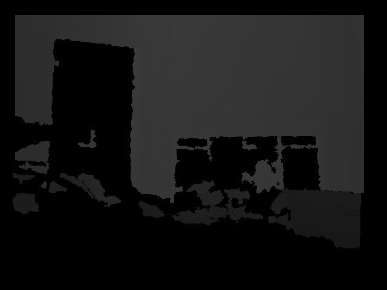
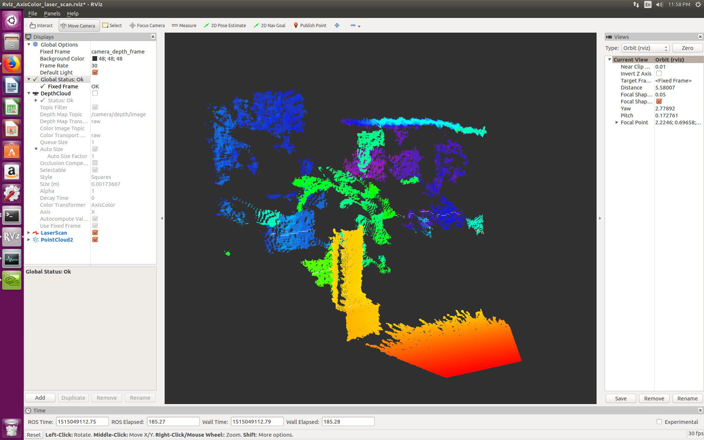

# Kinect-in-ROS
Install Kinect v1 in ROS environment


```
$ sudo apt-get update
$ sudo apt-get upgrade


$ sudo apt-get install libfreenect-dev
$ sudo apt-get install ros-kinetic-freenect-launch

$ roslaunch freenect_launch freenect.launch

```
In new terminal, 
```
$ rostopic list
$ rqt_image_view /camera/depth/image
```
You should be able to see some image from the kinect device. 
<p align="center">
 
</p>


## Processing depth images
```
$ sudo apt-get install ros-kinetic-depthimage-to-laserscan
$ rosrun depthimage_to_laserscan depthimage_to_laserscan image:=camera/depth/image_raw
```
<p align="center">
 
</p>

In new terminal
```
$ rqt_image_view
```
In new terminal
```
$ rosrun rviz rivz
```
<p align="center">
 
</p>
